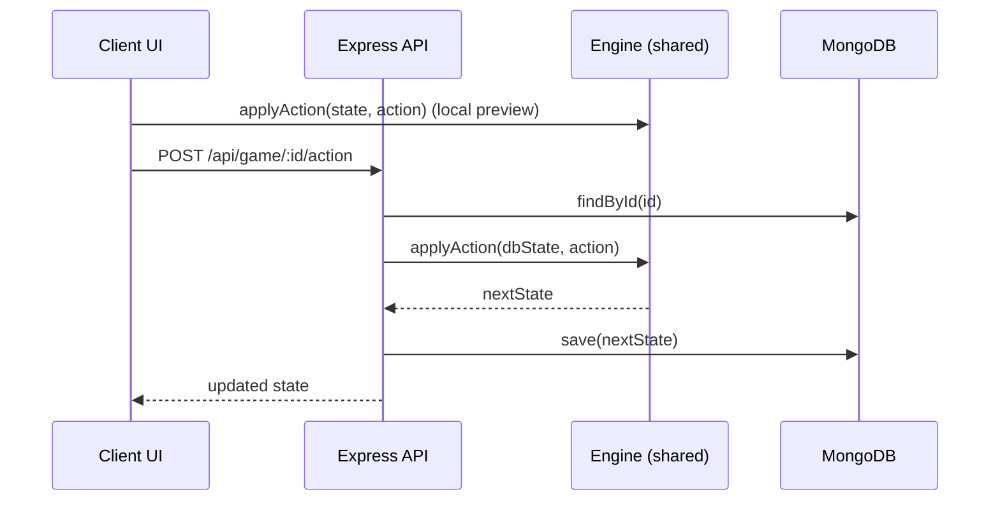

# Codebase Overview

Start here to understand how the monorepo hangs together. Deep dives live in:
- `engine.md` — ruleset, world gen, AI, action handling
- `client.md` — React UI, component/state flows, engine integration
- `server.md` — Express API, persistence, env config
- `testing.md` — how and where to test

## Layout Snapshot
- Root scripts fan out to workspaces defined in `package.json`.
- `engine/`: Pure TypeScript ruleset. Core types/constants/hex math under `src/core`, world gen under `src/map`, rules/turn loop/AI under `src/game`, re-exports in `src/index.ts`.
- `client/`: React + Vite UI. Entrypoint `src/main.tsx`; main surface in `src/App.tsx`; rendering in `src/components` (`GameMap`, `HUD`, `TechTree`); local helpers in `src/utils` (thin wrappers or mirrors of engine exports).
- `server/`: Express API + MongoDB. Entrypoint `src/index.ts`; routes in `src/routes/game.ts`; Mongoose model in `src/db/models.ts`.
- `docs/`: Rulebook, dev spec, changelog, and this folder.

## Commands You’ll Use Most
- Install once at root: `npm install`
- Dev servers: `npm run dev` (all workspaces) or targeted `npm run dev -w client` / `-w server`
- Build: `npm run build` (all) or `npm run build -w engine|client|server`
- Tests: `npm test -w engine` (Vitest unit/e2e)
- Lint: `npm run lint -w <workspace>`

## Getting Up to Speed Quickly
- Read `engine.md` to learn actions, rules, and map generation; most logic changes happen there.
- Run `npm run dev` to load the client and scan `client.md` for component entry points.
- If persisting games, set `MONGO_URI` and start `npm run dev -w server`; see `server.md`.
- Before changes, add seeds for reproducibility in tests and keep client `src/utils` in sync with engine logic where duplicated.

## High-Level Architecture
```mermaid
graph LR
  UI[React UI\n(client/src)] --> EnginePkg[@simple-civ/engine\nin-browser]
  UI -->|HTTP JSON| API[/Express API\n/server/src/routes/game.ts/]
  API --> EngineSrv[@simple-civ/engine\nin-server]
  API --> DB[(MongoDB\nGame collection)]
  EnginePkg --> StateLocal[(GameState)]
  EngineSrv --> DB
```

## Runtime Flows
- Local play: Client imports engine to generate worlds, apply actions, and render; saves to `localStorage`.
- With backend: Client POSTs to `/api/game/:id/action`; server loads `GameModel.state`, applies the action via engine, saves, and returns updated state. Creating a game: `POST /api/game` with `mapSize` + `players`.



## Data Model & Persistence
- `GameModel` stores `state: GameState` as a Mongoose Mixed object with timestamps; schema-free inside the blob.
- `GameState` (see `engine/src/core/types.ts`) includes map tiles, units, cities, players, diplomacy, visibility, tech progress, and RNG seed.
- Mongo connection via `MONGO_URI` (`PORT` optional) in `.env`; default `mongodb://localhost:27017/simple-civ`.

## Fast Lookup by Task
- Turn logic & actions: `engine/src/game/turn-loop.ts`
- Yields/city math: `engine/src/game/rules.ts`
- Map generation: `engine/src/map/map-generator.ts`
- AI orchestration: `engine/src/game/ai*.ts`
- UI rendering/interaction: `client/src/components/*.tsx`, app state in `client/src/App.tsx`
- Server endpoints: `server/src/routes/game.ts`

## Extending Safely
- Keep engine pure (no I/O or globals) and return new `GameState` instances.
- When adding actions, update `Action` in `engine/src/core/types.ts`, implement in `applyAction`, and cover with Vitest.
- Validate user-facing input on both client and server; do not trust only client checks.***
