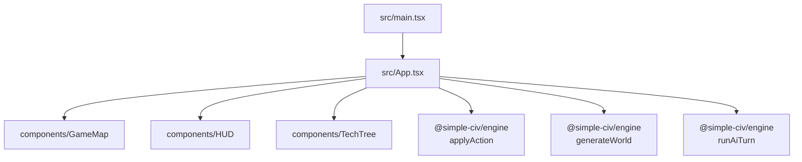

# Client (React + Vite)

Single-page app that renders the map, HUD, and tech tree while delegating game logic to the engine package. Entry is `src/main.tsx`, which renders `App`.

## Component & State Flow

- `App.tsx` holds the authoritative `GameState`, selection (`selectedCoord`, `selectedUnitId`), and player id. It calls `generateWorld` from `@simple-civ/engine`, applies actions, and auto-plays AI turns.
- `GameMap` renders hexes in SVG using axial coords; respects `visibility` and `revealed` from `GameState` for fog/shroud. Selecting a tile triggers `onTileClick`.
- `HUD` lets the player issue actions (movement is done from map selection; build/research/diplomacy/end-turn are buttons). It uses `canBuild` from the engine to gate options.
- `HUD.tsx` is now just a compositor for `components/HUD/sections` (ActionBar, TechButton, UnitList, UnitPanel, CityPanel, DiplomacySummary) plus shared hooks/helpers in `components/HUD/hooks|helpers`, keeping per-feature logic isolated and unit-tested with Vitest/RTL smoke specs.
- `TechTree` surfaces research options, grouping techs by era with constraints based on prerequisites and era counts.
- Utilities: only `utils/hex.ts` (SVG/interaction geometry) and `utils/rivers.ts` (client-side river rendering helpers) remain. All gameplay data (types, rules, constants, AI, map gen) now come straight from the engine package.

## Engine Integration Notes
- Client imports types and helpers directly from `@simple-civ/engine`; no gameplay mirrors remain in `src/utils`.
- Actions: `applyAction` is imported directly from `@simple-civ/engine` (no more client duplicate). HUD buttons dispatch typed `Action` objects; errors are surfaced via alerts in `App.tsx`.
- AI: `App.tsx` calls `runAiTurn` from `@simple-civ/engine`; there is no local wrapper.

## Rendering & Interaction
- Hex sizing is fixed by `HEX_SIZE` in `GameMap.tsx`; adjust viewBox if map sizes change dramatically.
- Visibility: tiles are hidden unless present in `gameState.visibility[playerId]`; shroud optionally hides unseen tiles. Fog uses reduced opacity.
- Units and cities are rendered minimally (colored circles/rectangles). Extend by enriching stats or adding overlays in the SVG layer.

## State Persistence
- Local single-player uses `localStorage` (`SAVE_KEY` in `App.tsx`) for save/load; no schema versioning. If you change `GameState`, consider migration or clearing saves.
- Backend play should persist via the server endpoints; add HTTP client helpers if wiring the UI to the API.

## Working on Features
- Add UI for a new action: ensure the action exists in the engine, expose a button or click path in HUD/GameMap, dispatch the `Action`, and handle visibility updates as needed.
- Expand diplomacy or research: update engine types/constants, surface new fields in HUD or TechTree, and style plainly with inline CSS or extend `index.css`.
- Performance: map render is naïve (`map.tiles.map` directly). For larger maps, consider memoizing `Hex` or chunking renders.

## Styling
- Styling is inline in components with a small `index.css`; no design system. Use consistent palette and avoid introducing CSS-in-JS.***
