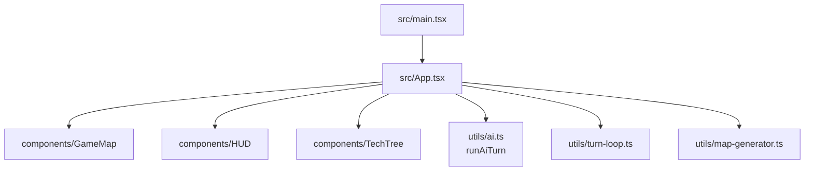

# Client (React + Vite)

Single-page app that renders the map, HUD, and tech tree while delegating game logic to the engine package (or local mirrors in `src/utils`). Entry is `src/main.tsx`, which renders `App`.

## Component & State Flow

- `App.tsx` holds the authoritative `GameState`, selection (`selectedCoord`, `selectedUnitId`), and player id. It generates a world, applies actions, and auto-plays AI turns.
- `GameMap` renders hexes in SVG using axial coords; respects `visibility` and `revealed` from `GameState` for fog/shroud. Selecting a tile triggers `onTileClick`.
- `HUD` lets the player issue actions (movement is done from map selection; build/research/diplomacy/end-turn are buttons). It uses `canBuild` from `utils/rules` to gate options.
- `TechTree` surfaces research options, grouping techs by era with constraints based on prerequisites and era counts.
- Utilities map: `utils/turn-loop.ts` (client-side actions), `utils/rules.ts` (yields/build gates), `utils/map-generator.ts` (world gen), `utils/hex.ts` (hex math), `utils/constants.ts` (copied engine constants), `utils/ai*.ts` (heuristics/decisions wrapper).

## Engine Integration Notes
- Client imports types and helpers from `@simple-civ/engine`, but also ships synced copies in `src/utils/*` (turn loop, rules, map gen, AI). These exist to run fully in-browser. When changing engine logic, mirror updates here or switch imports to the shared package to avoid drift.
- Actions: `applyAction` (client utils) mirrors engine’s handler list. HUD buttons dispatch typed `Action` objects; errors are surfaced via alerts in `App.tsx`.
- AI: `utils/ai.ts` wraps engine `runAiTurn` to keep a single source of truth.

## Rendering & Interaction
- Hex sizing is fixed by `HEX_SIZE` in `GameMap.tsx`; adjust viewBox if map sizes change dramatically.
- Visibility: tiles are hidden unless present in `gameState.visibility[playerId]`; shroud optionally hides unseen tiles. Fog uses reduced opacity.
- Units and cities are rendered minimally (colored circles/rectangles). Extend by enriching stats or adding overlays in the SVG layer.

## State Persistence
- Local single-player uses `localStorage` (`SAVE_KEY` in `App.tsx`) for save/load; no schema versioning. If you change `GameState`, consider migration or clearing saves.
- Backend play should persist via the server endpoints; add HTTP client helpers if wiring the UI to the API.

## Working on Features
- Add UI for a new action: ensure the action exists in the engine, expose a button or click path in HUD/GameMap, dispatch the `Action`, and handle visibility updates as needed.
- Expand diplomacy or research: update engine types/constants, surface new fields in HUD or TechTree, and style plainly with inline CSS or extend `index.css`.
- Performance: map render is naïve (`map.tiles.map` directly). For larger maps, consider memoizing `Hex` or chunking renders.

## Styling
- Styling is inline in components with a small `index.css`; no design system. Use consistent palette and avoid introducing CSS-in-JS.***
