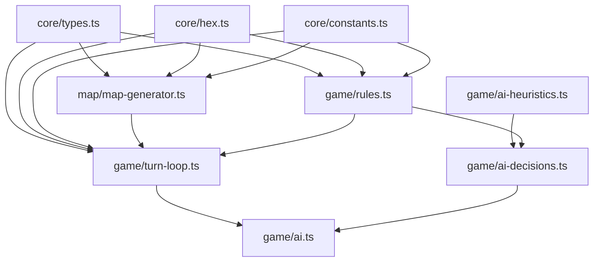
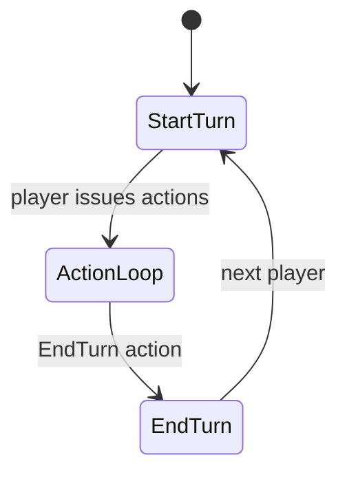

# Engine Internals

The `@simple-civ/engine` workspace holds all deterministic game logic. Everything else (UI, API) depends on exports re-exported in `engine/src/index.ts`.

## Module Map

## State & Entities
- `GameState` (see `core/types.ts`): map tiles (`terrain`, `overlays`, `ownerId`), units (type/hp/moves/owner/flags), cities (pop, yields, builds, worked tiles), players (techs, projects, traits), diplomacy (contacts, offers, shared vision), visibility arrays, RNG seed.
- `constants.ts` encodes raw rules: terrain yields/move costs, unit/building stats, tech/project data, map sizes, city work radius, and combat tuning.
- Hex math lives in `core/hex.ts` (neighbors, distance, lines, spirals) and underpins movement, vision, river placement, and city work radius checks.

## Action & Turn Flow
- Entry: `applyAction(state, action)` in `game/turn-loop.ts` clones state, validates player/turn, and dispatches handlers.
- Supported actions: `MoveUnit`, `Attack`, `CityAttack`, `FoundCity`, `ChooseTech`, `SetCityBuild` (unit/building/project), `RazeCity`, `SetWorkedTiles`, `SetDiplomacy`, `ProposePeace/AcceptPeace`, `ProposeVisionShare/AcceptVisionShare/RevokeVisionShare`, `EndTurn`.
- Movement enforces adjacency, terrain/domain rules, and occupancy (military vs civilian stacking). Combat uses `ATTACK_RANDOM_BAND`, `DAMAGE_MIN/MAX` to bound rolls.
- End turn: rotate `currentPlayerId`, refill moves, tick production/tech, apply growth checks (`getGrowthCost`), recalc visibility from units/cities, clear fire/attack flags.
- Errors throw (e.g., wrong turn, impassable terrain); callers must catch.

## Yields & City Rules
- `game/rules.ts` centralizes yield math: base terrain + overlay bonuses, city center minimums, river adjacency bonus (+1 Food when worked), buildings with conditional bonuses (Reservoir if river-adjacent, LumberMill if working forest), base +1 Science per city, and project/civ trait modifiers.
- `canBuild` gates builds based on tech unlocks, existing structures, project prerequisites, and domain (e.g., naval units disallowed on landlocked cities via terrain checks elsewhere).
- Growth costs depend on population, `GROWTH_FACTORS`, and city yields; city work radius is constrained by `CITY_WORK_RADIUS_RINGS`.

## Map Generation (`map/map-generator.ts`)
- Seedable PRNG via `generation/seeding.ts` (`WorldRng` + `resolveSeed`); reproducible when `settings.seed` is provided.
- Builds hex grid sized by `MAP_DIMS`, then defers to `generation/terrain.ts` for coast bias, biome noise, mountain clusters, and overlay placement.
- River workflow lives in `generation/rivers.ts`: selects high-elevation starts, runs constrained A* toward distinct coasts, records edge graphs, emits corner-based polylines, and tags land tiles with `RiverEdge` overlays.
- `generation/starts.ts` enforces start guarantees (food/prod tiles in radius 2, workable land) and spacing before `map-generator.ts` spawns starting units (Settler + Scout + Spear Guard baseline; Starborne adds a bonus Scout; civ hooks allow extras).
- Seeds per-player units, generates native camps (counts scaled by map size, 3-hex territories, 1 Champion + 2 Archers each, with NativeCamp/ClearedSettlement overlays), initializes visibility/contact/shared-vision/diplomacy matrices, assigns game id, and returns the initial `GameState`.

## AI Loop
- `game/ai/goals.ts` derives/records victory bias (Observatory → Progress, strike-range capital → Conquest); `game/ai/tech.ts` maps goals to tech paths and dispatches `ChooseTech`.
- `game/ai/cities.ts` manages `SetCityBuild` queues and worked tiles, leaning on `game/ai/city-heuristics.ts` to rank yields per goal.
- `game/ai/units/` splits unit behavior by concern: `exploration.ts` (peace scouts/settler guards), `settlers.ts` (founding + escorts), `defense.ts` (garrisons/rotation/ranged reposition), `offense.ts` (targeting, capture routing, war movement), `titan.ts` (Titan rush). Shared helpers (damage math, siege memory, war targeting, movement) live in `units/unit-helpers.ts`. `game/ai/units.ts` re-exports the suite for existing callers. Shared deps: `ai/shared/actions.ts` (safe `applyAction`), `ai/shared/metrics.ts` (distance sorting), `ai/helpers/pathfinding.ts`.
- `game/ai/diplomacy.ts` loops opponents via `aiWarPeaceDecision` and emits `SetDiplomacy` / peace offers.
- `game/ai/turn-runner.ts` sequences goal → tech → cities → units → diplomacy, while `game/ai.ts` simply invokes the runner and finishes with `EndTurn`.
- `ai-heuristics.ts` still scores city sites; `ai-decisions.ts` now focuses on war/peace heuristics, re-exporting goal/tech helpers for compatibility.
- Client auto-skips AI turns in `App.tsx` by repeatedly calling `runAiTurn` until a human is current (safety-limited to 10 iterations).

## Extending the Engine
- Add a new action: update `Action` in `core/types.ts`, implement handler in `turn-loop.ts`, add any rule helpers/constants needed, and cover with Vitest.
- Add terrain/overlay/unit/building/tech/project: extend `constants.ts` and related enums, adjust rules/AI heuristics if yields or movement change, and ensure map gen or UI surfaces the new content.
- Keep pure: avoid I/O or timers; the engine should be deterministic given a state/action (aside from explicit RNG inside combat or map gen where seeds are available).

## Testing
- Vitest specs live beside code: `game/turn-loop.test.ts`, `game/ai.e2e.test.ts`, `map/map-generator.test.ts`, `game/rules.test.ts`. Add new cases adjacent to the module you change and seed randomness when possible.***

## Turn Loop Modules (2025-11-24)

- `game/turn-loop.ts`: owns `applyAction` and `ChooseTech`, re-exporting helper namespaces for downstream use.
- `game/actions/units.ts`: `MoveUnit`, `Attack`, `LinkUnits`, `UnlinkUnits`, including shared-move logic and post-move vision refresh.
- `game/actions/cities.ts`: city-specific actions (`CityAttack`, `FoundCity`, build queue management, `RazeCity`, `SetWorkedTiles`).
- `game/actions/diplomacy.ts`: peace/vision offers plus diplomacy state changes (war wipes shared vision).
- `game/turn-lifecycle.ts`: `EndTurn`, per-player refresh/growth, round-end victory checks.
- `game/vision.ts`: visibility recomputation, shared-vision enforcement, contact discovery.
- `game/helpers/`: shared `movement`, `combat`, `cities`, and `diplomacy` utilities consumed across action modules.

This split keeps behavior identical to the previous monolith while letting clients import targeted helpers instead of duplicating the entire loop.
