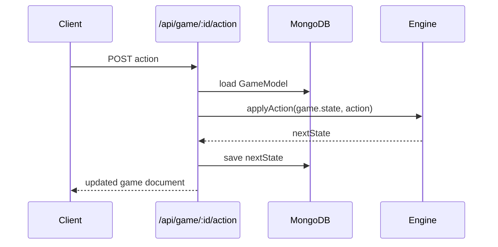

# Server (Express + MongoDB)

Lightweight API that wraps the engine to provide persistence and multiplayer endpoints. All requests are JSON over HTTP.

## Structure
- `src/index.ts`: bootstraps Express, enables CORS/JSON body parsing, connects to Mongo via `mongoose.connect`, mounts routes.
- `src/routes/game.ts`: REST routes for creating games, fetching games, and applying actions.
- `src/db/models.ts`: Mongoose `GameModel` with `{ state: GameState }` stored as a Mixed object plus timestamps.

## Routes
- `POST /api/game`: body `{ mapSize?: "Small"|"Standard"|"Large", players: Array<{id,civName,color,ai?:boolean}> }`; returns created game document with generated `state`.
- `GET /api/game/:id`: fetch saved game by Mongo `_id`.
- `POST /api/game/:id/action`: body is an `Action` object; server loads game, calls engine `applyAction`, saves, and returns updated doc. Errors (validation/turn order/etc.) return `400` with message.
- `GET /health`: liveness probe, returns `OK`.

## Environment & Running
- Required env: `MONGO_URI` (default `mongodb://localhost:27017/simple-civ`), optional `PORT` (default `3000`). Use a `.env` file locally.
- Dev: `npm run dev -w server` (ts-node-dev). Build: `npm run build -w server`, Run compiled: `npm start -w server`.
- Mongo schema is flexible; no migrations. Clear or version saved documents if you change `GameState` shape.

## Adding/Changing Endpoints
- Extend `gameRouter` with new routes; validate inputs explicitly (do not trust client). Keep responses JSON with error messages.
- Reuse engine types for inputs/outputs to avoid drift. If you add a new action, ensure the engine supports it first, then accept it on the route.
- For multi-tenant or auth, add middleware before `app.use("/api/game", gameRouter);`. Currently open by default.

## Error Handling & Logging
- Errors in action application return `400` with the engine-thrown message; unexpected errors return `500`. Keep logs concise (avoid leaking state blobs).
- Consider adding request ids and structured logging if traffic grows; not present today.

## Deployment Notes
- Expect stateless server; persistence is entirely in Mongo. Connection is established at startup and kept alive. Horizontal scaling is safe as long as Mongo is shared.
- CORS is enabled for all origins; tighten if deploying to restricted environments.***
